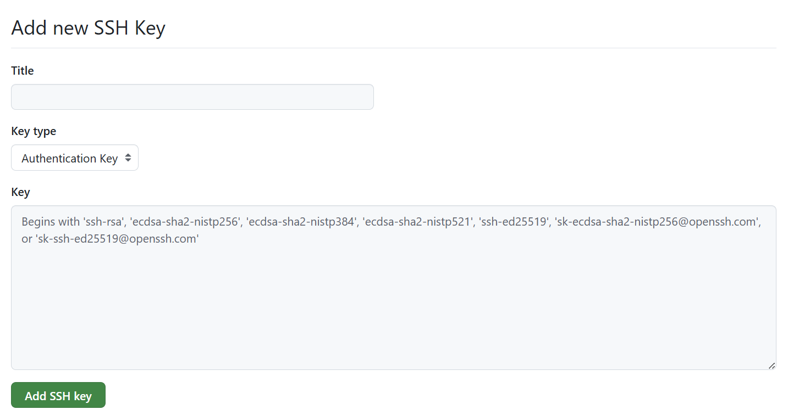
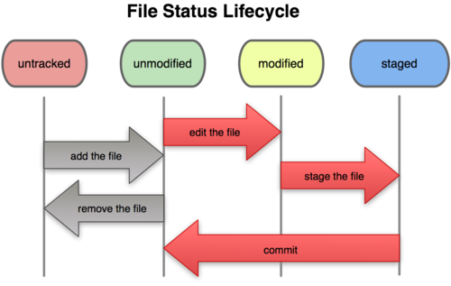

# 採用技術
### 前端: Vue + Typescript
### 後端: FastAPI 

# 規章
## 採用開發流程 (Extreme Programming)
TDD (Test-Driven Development)，測試是確保產品穩定的基石

1. 定義介面 (The Contract) — 全組共識
這是唯一需要先溝通的地方。 在寫任何 Code 之前，你要先定義「我要呼叫別人的函式長什麼樣子」。
    * 動作： 定義 IRestaurantRepository (Interface)。
    * 狀態： 此時只有空殼函式，沒有任何實作。
2. 先寫測試 (The Test / Red)
    * 這是第一行程式碼。
    * 你的心態： 「假設我的業務邏輯已經寫好了，我要怎麼驗證它？」
    * 遇到的問題： 你會發現你需要一個「資料庫」來提供數據，但真正的資料庫還沒寫好。
    * 解決方案： 所以你在測試檔裡，自己寫一個 Mock (模擬物件) 來假裝是那個資料庫。
    * 誰寫 Mock？ 你自己寫！ 因為是你需要依賴它來跑測試，你最清楚你需要它回傳什麼假資料。

3. 執行測試 -> 失敗 (Red State)
    * 結果： 測試執行失敗 (Fail) 或報錯 (Error)。
    * 原因： 因為你連業務邏輯的 class 都還沒建，或者函式是空的。
    * 意義： 這證明了測試是有效的（不會永遠通過）。

4. 寫業務邏輯 (The Implementation / Green)
    * 動作： 終於開始寫功能代碼了。去實作你的 Service Class。
    * 目標： 只寫「剛好能通過測試」的程式碼。不要多寫，不要最佳化。

5. 再次執行測試 -> 通過 (Green State)
    * 結果： 綠燈 (Pass)。
    * 意義： 你的邏輯是對的，且跟別人的模組（透過 Interface）接合是正確的。
6. 重構 (Refactor)
    * 動作： 整理程式碼，把變數命名改好，優化演算法。
    * 保障： 因為有測試在，你怎麼改都不怕改壞。


## Github 使用教學
###  如何使用SSH key(設定後不需要每次手動輸入密碼，自動與 GitHub 連線，節省時間)
1. 用以下指令產生你的SSH key，然後一路按enter 或 有說要Yes/No就輸入Yes
    ```
    ssh-keygen -t ed25519 -C "{your_email@example.com}"
    ```
2. 將SSH public key複製起來
    ```
    cat ~/.ssh/id_ed25519.pub | clip
    ```
3. 在github頭像 -> Setting -> SSH and GPG keys -> New SSH key

4. 用以下指令測試是否已經可以連接github
    ```
    ssh -T git@github.com
    ```
### 如何合作 

> [!TIP] 
> 如果還沒設定過git，先去安裝
> https://git-scm.com/install/windows

#### 我們先設定有3種分支(branches)，以下是分支結構
1. main (不能亂動)
    * 定義： 這是 Demo 當天要跑的版本。
    * 規則：
        1. 絕對禁止直接 Push 程式碼進去。
        2. 只有當 dev 分支測試沒問題，且準備好要交作業或報告時，才從 dev 合併過來。
    * 目的： 保命。就算dev版本爛掉了，至少還有一個能動的版本可以拿去 Demo。
2. dev (測試區)
    * 定義： 大家程式碼「會合」的地方。
    * 規則：
        1. 這是你們平常主要的合併目標。
        2. 這裡的程式碼可能會壞掉（因為大家剛合併），這很正常 (前後端對接就在這裡測試)。
3. feature/你的名字-功能 (自己實作功能地方)
    * 定義： 這是你真正寫程式的地方。
    * 命名建議： feature/yueyue-seat-grid、feature/ian-map-ui。
    * 規則：
        1. 一個功能開一個分支，做完就合併回 dev，然後刪除這個分支。
        2. 在這個分支裡，你愛怎麼改都可以，完全不會影響到隊友。

#### 怎麼開分支，然後coding
以下會直接開啟一個分支並自動切換分支
```
git switch -c {新的分支名稱}
```
就可以開始coding了
#### 我們每個人寫完程式碼時要怎麼上傳到github 

> [!NOTE]
> 以下是git 狀態圖，以下四個狀態都是在本機進行
> 1. untracked: 檔案是新的，Git 知道它存在於工作目錄，但尚未納入版本控制。
> 2. unmodified: 檔案已經被 Git 追蹤，且其內容與上次commit的內容完全一致。
> 3. modified: 檔案已經被 Git 追蹤，但有被跟改，使其與上次提交不同。
> 4. staged (已暫存): 檔案的特定版本已經被標記，準備好包含在下一次push中。
> 

1. 檢查自己改了甚麼地方，並確認自己所在的分支
    ```
    git status
    ```
2. 將更改檔案或新檔案加入git版本控制
    ```
    git add .
    ```
3. 將這次修改內容放到Staged區域
    ```
    git commit -m "your comment about this push"
    ```
4. 拉取最新 dev
    ```
    git fetch origin
    git merge origin/dev
    ```
5. 將這次修改上傳到github
    > [!NOTE]
    > 如果是初次推送或建立追蹤時用以下指令，以後都可以用最下面的
    > ```
    > git push -u origin {你的分支名稱}
    > ```
    ```
    git push
    ```

> [!CAUTION]
> 如果第三步發生衝突，這代表你寫的code跟別人有重疊到，
> 而衝突檔案會標記: 
> ```
> <<<<<<< HEAD
> 你的修改
> =======
> 別人的修改 (dev 分支)
> >>>>>> origin/dev
> ```
> 處理方式: 
> 1. 決定要保留哪一段或手動合併兩段
> 2. 刪掉 <<<<<<<, =======, >>>>>>> 標記
> 3. 儲存檔案


> [!IMPORTANT]
> 在開始新的一輪寫code時，要再次把dev最新狀態抓下來，再開一個分支
> 1. 首先切回dev分支
>    ```
>    git switch dev
>    ```
> 2. 同步dev最新狀態
>    ```
>    git pull
>    ```
> 3. 開啟新的一輪coding(功能實作)
>    ```
>    git switch -c {新的分支名稱}
>    ```
> 4. 後續動作一樣

#### 如何合併回dev分支
1. 完成push程式碼到你自己的分支後
2. 到Github網頁開啟pull request
3. (希望)會先跑git action測測看測試是不是通過
3. 這階段會需要至少通過一名組員review後，才能合併
